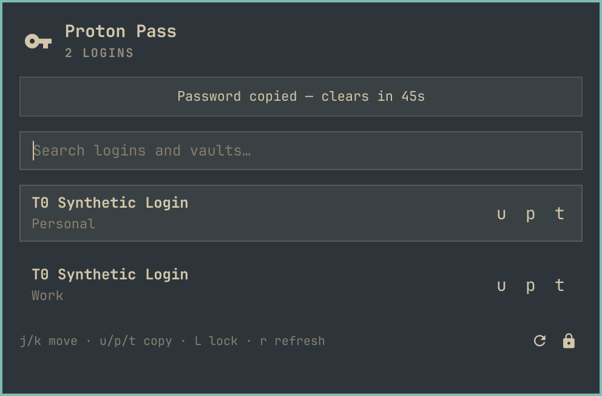

# Proton Pass for Omarchy

A native Omarchy Quattro bar widget for keyboard-first Proton Pass login search and safe Wayland clipboard copy through Proton's official [`pass-cli`](https://protonpass.github.io/pass-cli/).



It complements the official Proton Pass apps and CLI rather than replacing them, and never displays a retrieved username, password, or TOTP code. The plugin makes no network connections of its own; only Proton's official `pass-cli` contacts Proton. [SECURITY.md](SECURITY.md) states every security claim plainly and shows you how to check each one yourself.

> [!IMPORTANT]
> Proton Pass CLI access requires a personal **Pass Plus** plan (or a bundle that includes it) or a business **Pass Professional** plan. Business **Pass Essentials is not eligible**. See Proton's [personal plan guide](https://proton.me/support/proton-pass-plans-explained) and [business plan comparison](https://proton.me/business/pass/pricing).

## Security at a glance

- **It makes no network connections of its own.** Only Proton's official `pass-cli` talks to Proton's servers. The plugin never opens a socket, never calls out, never "phones home."
- **It never sees your Proton password.** Signing in opens Proton's own `pass-cli` in a terminal. Your password and any 2FA go straight to Proton; the plugin only checks afterward that a session exists.
- **It never shows or stores a secret.** Field values go from `pass-cli` straight to your clipboard, marked sensitive. They never appear in the panel, never touch a log, never land in a file.
- **The only things it writes to disk** are a list of recently used item IDs (no names, no secrets) and a one-way hash of the last value it copied (used to auto-clear the clipboard safely). Both are yours-only files, and the recents list is deleted the moment you turn the setting off.

Every claim above is verifiable. [SECURITY.md](SECURITY.md) has the full model, the honest limits, and the greps and tests you can run to check each claim yourself.

## Features

- Search login items across your vaults by title or vault name.
- Copy a username, password, or TOTP code with one keystroke. Username falls back to email.
- Create a login with a generated password, straight from the panel.
- Recently used logins show first, with when each was last used.
- Copied values are marked sensitive, kept out of clipboard history, and cleared after a set delay. Clear one now from the panel too.
- Lock or log out of the session; logout asks for confirmation.
- Sign in and unlock through Proton's own CLI in a terminal.

Editing, deleting, sharing, attachments, custom-password creation, secret display, and offline use are out of scope.

## Requirements

- Omarchy Quattro (4.x)
- Proton Pass CLI 2.3 or newer on `PATH`
- An eligible Proton plan as described above
- `wl-clipboard`
- Network access for every refresh and copy
- `jq`, `bash`, and GNU coreutils, which are included with Omarchy

## Install

1. Install Proton's official CLI if needed. On Arch, the community package is
   `proton-pass-cli-bin`:

   ```bash
   yay -S proton-pass-cli-bin
   ```

   On other distributions, see Proton's [`pass-cli` documentation](https://protonpass.github.io/pass-cli/)
   for official packages.

   > [!WARNING]
   > The AUR package named `pass-cli` is an unrelated project. Do not install it for this plugin.

2. Install the Wayland clipboard tools:

   ```bash
   sudo pacman -S wl-clipboard
   ```

3. Add and enable the plugin:

   ```bash
   omarchy plugin add https://github.com/josh2c/omarchy-protonpass.git --enable
   ```

4. Open the key icon in the bar. If you are signed out, choose **Sign in**. The plugin launches plain `pass-cli login` in a terminal, which uses Proton's browser authentication flow.

The panel automatically rechecks the session when it is opened again after login or unlock.

## Create a login

Choose the **Create login** action, enter a title and a username or email, and pick a vault. The helper generates a random 24-character password and hands the login to `pass-cli`; the password never touches the UI, arguments, logs, or files (see [SECURITY.md](SECURITY.md)). Use **Copy password** in the success message to copy it once.

To set your own password, use an official Proton Pass app. The CLI has no safe interactive create flow, and typing a password into a shell command would leak it through shell history.

## Keyboard use

The panel opens with search focused. Row buttons intentionally contain no visible shortcut labels or hover shortcut hints; this section is the sole shortcut reference.

### Global chords

These work while typing in search and while navigating the list.

| Chord | Action |
|---|---|
| `Enter` | Copy password |
| `Shift+Enter` | Copy username, falling back to email |
| `Ctrl+U` | Copy username, falling back to email |
| `Ctrl+P` | Copy password |
| `Ctrl+T` | Copy TOTP |
| `Ctrl+R` | Refresh the index |
| `Ctrl+L` | Lock the Proton Pass CLI session |
| `Ctrl+Shift+X` | Clear the plugin-owned clipboard value now |

### List and search keys

| Key | Context and action |
|---|---|
| Type | In search: filter by login title or vault name |
| `Down` or `Tab` | From search: enter list navigation |
| `j` / `k` or `Down` / `Up` | In list focus: move through results |
| `p` | In list focus: copy password |
| `u` | In list focus: copy username, falling back to email |
| `t` | In list focus: copy TOTP |
| `L` | In list focus: lock the Proton Pass CLI session |
| `r` | In list focus: refresh the index |
| `/` or another printable key | From list focus: return to search; `/` itself is not inserted |
| `Esc` | Clear search, then close the panel |

Modifier chords can be remapped with the **Keyboard shortcuts** setting. Enter comma-separated `chord:action` pairs, for example:

```text
ctrl+shift+c:copy-password,ctrl+o:logout
```

Chord grammar is `(ctrl+)?(shift+)?(alt+)?(enter|f[1-9]|[a-z])`, case-insensitive. Actions are `copy-username`, `copy-password`, `copy-totp`, `clear-clipboard`, `lock`, `logout`, and `refresh`. Invalid entries are ignored. A remapped logout chord still uses the panel's two-step confirmation.

Mouse users can select a row and use its explicit username, password, or TOTP action. Selection alone never copies anything.

### Session locking

`pass-cli session lock` works only after a session lock has been configured. Run this once in a terminal if you want the panel's `L` action:

```bash
pass-cli session create-lock
```

The unlock button launches `pass-cli session unlock` in a terminal so the CLI handles the lock credential directly.

## Settings

Configure the widget through Omarchy's plugin settings.

| Setting | Default | Range / behavior |
|---|---:|---|
| Clear clipboard after | 45 seconds | 0–300 seconds; `0` disables automatic clearing |
| Paste once | Off | Offers the value once with `wl-copy -o`; some browsers and Electron apps read more than once and may fail to paste |
| Excluded vaults | Empty | Comma-separated, case-sensitive exact vault names; surrounding spaces are trimmed |
| Keyboard shortcuts | Empty | Comma-separated `chord:action` overrides; unmodified defaults remain active |
| Show recent items | On | Shows up to eight recently copied logins; turning it off deletes the local recents store immediately |

Vault names containing commas cannot be excluded individually in v1.

## Update or uninstall

Review and apply plugin updates with:

```bash
omarchy plugin update josh2c.protonpass
```

Disable the widget without removing its checkout:

```bash
omarchy plugin disable josh2c.protonpass
```

Remove it completely:

```bash
omarchy plugin remove josh2c.protonpass
```

Removing this plugin does not uninstall Proton Pass CLI or alter Proton's session files.

## Development

The test suite uses captured, identity-free CLI fixtures and mocks; CI needs no Proton account or network access.

```bash
tests/helper-test.sh
tests/security-test.sh
tests/manifest-test.sh
tests/source-contract-test.sh
omarchy plugin validate .
```

Contributors: the implementation plan and release acceptance checklists live on the [`dev-docs`](https://github.com/josh2c/omarchy-protonpass/tree/dev-docs) branch, kept out of the installed plugin tree.

## License

MIT
